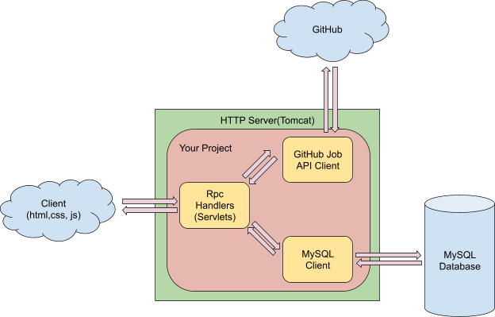
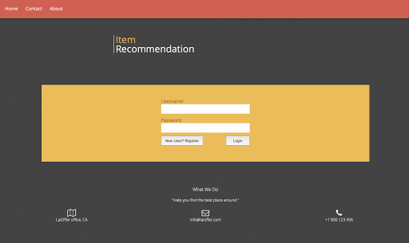

# A Personalized Job Recommendation Engine
* Designed and implemented an interactive web application for users to search and apply available job positions.
* Performed front-end web UI design and implementation using HTML/CSS/JavaScript. 
* Implemented RESTful APIs using Java servlets, retrieved job descriptions using Github API and stored data in MySQL.
* Explored multiple recommendation algorithms and extracted keywords from job descriptions to implement a Content-based algorithm.

## Architecture

## Demo

